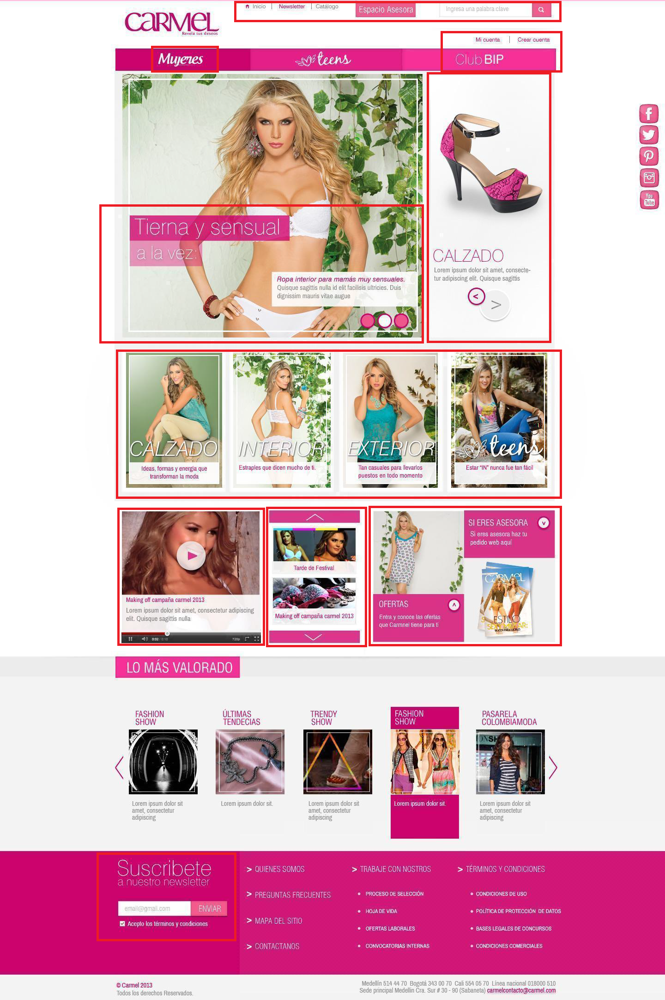
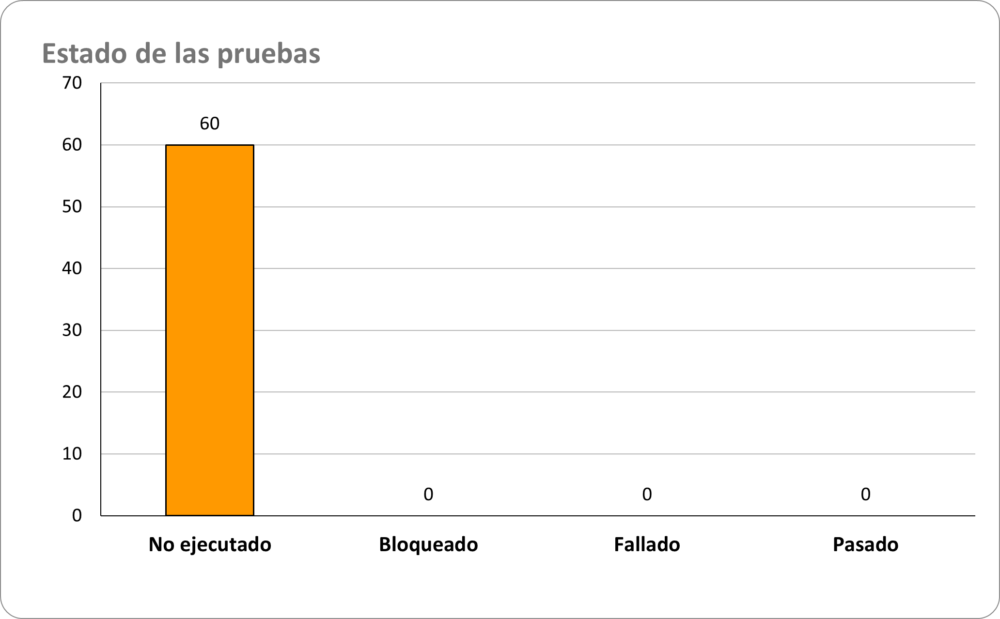
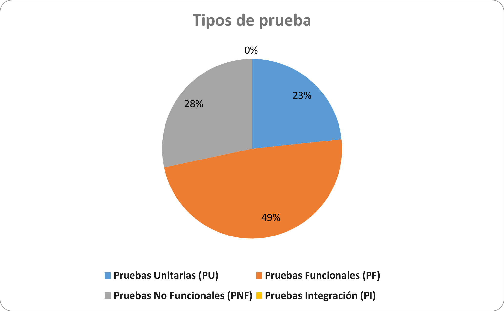
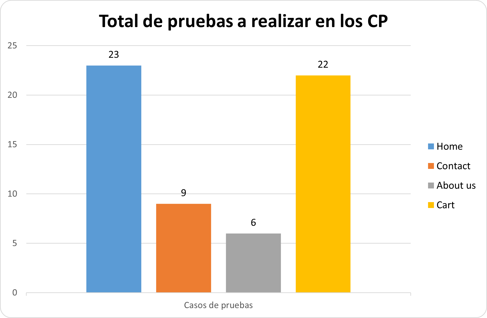

# PruebaTecnicaPragma

1. [Comparación de imagenes.](Comparación-de-Imágenes/)
2. [Componente teórico.](Componente-Teórico/)
3. [Consulata SQL.](Consulta-SQL/)
4. [Mindset QA.](Mindset-QA/)
5. [Automatización de pruebas.](Pruebas-automatizadas/)

## 1. [Comparación de imagenes.](Comparación-de-Imágenes/)

## 4. [Mindset QA.](Mindset-QA/)

El diseño del caso de prueba realizado muestra el estado de ejecución actual de cada tipo de prueba y el número total de casos de prueba diseñados para cada funcionalidad del sistema. Aquí está el resumen:

## Resultado de las pruebas:
- No Ejecutado: 60 casos de prueba.
- Bloqueado: 0 casos de prueba.
- Fallado: 0 casos de prueba.
- Pasado: 0 casos de prueba.

## Desglose por tipo de pruebas y porcentajes:
- Pruebas Unitarias (PU): 14 casos de prueba (23%).
- Pruebas Funcionales (PF): 29 casos de prueba (48%).
- Pruebas No Funcionales (PNF): 17 casos de prueba (28%).
- Pruebas Integración (PI): 0 casos de prueba (0%).

## Desglose por funcionalidad:
- Home: 23 pruebas.
- Contact: 9 pruebas.
- About us: 6 pruebas.
- Cart: 22 pruebas.

## Total de casos de prueba: 12.
- Total de pruebas: 60 

Este análisis proporciona una visión general del estado de las pruebas en términos de cobertura y ejecución. Los resultados muestran que aún no se han ejecutado las pruebas, pero se han diseñado una variedad de casos de prueba para cubrir diferentes aspectos del sistema. Se espera que el tester aplique las pruebas con base en su experiencia y agregue nuevos casos de prueba según sea necesario para mejorar la estabilidad del proyecto y futuros proyectos.

## 5. [Automatización de pruebas.](Pruebas-automatizadas/)
    
Se ha creado un script de automatización que sigue el flujo normal de un proceso de compra en un sitio web, abarcando las siguientes acciones:

1. Selección de producto: Se ha implementado una función para seleccionar múltiples productos y agregarlos al carrito de compras. Para esto, se utiliza una lista de elementos XPath que representan los productos a seleccionar.

2. Agregado al carrito de compras: Se ha desarrollado una funcionalidad para agregar los productos seleccionados al carrito de compras. Esto se logra haciendo clic en los botones correspondientes en la página web.

3. Eliminación de un producto del carrito de compras: Se ha incorporado un procedimiento para eliminar un producto específico del carrito de compras. Esto se logra haciendo clic en el botón de eliminar correspondiente al producto en la lista del carrito.

4. Pago de los productos: Se ha implementado una función para realizar el pago de los productos en el carrito. Este proceso implica hacer clic en el botón de "Pagar", lo que desencadena una serie de acciones relacionadas con el pago y la finalización de la transacción.

Para llevar a cabo estas acciones, se ha utilizado Selenium WebDriver en conjunto con Python. Se ha estructurado el código en clases y métodos para una mejor organización y reutilización del código. Además, se han creado casos de prueba que validan el comportamiento esperado de las funciones implementadas.

El script de automatización se ejecuta en un navegador Chrome y genera un informe HTML detallado que proporciona una visión general de las pruebas realizadas y sus resultados. Este informe incluye información sobre los casos de prueba ejecutados, así como cualquier error o excepción que pueda surgir durante la ejecución.

## Estándares que se aplicaron en la prueba técnica.

En esta prueba técnica, se aplicaron varios estándares y metodologías recomendadas por el ISTQB (International Software Testing Qualifications Board) para el diseño y ejecución de pruebas de software. Algunos de los estándares y metodologías aplicados incluyen:

- ISTQB Syllabus: Se siguieron los lineamientos y contenidos definidos en el Syllabus del ISTQB para asegurar una cobertura adecuada de los diferentes tipos de pruebas, como pruebas unitarias, funcionales, no funcionales e integración.

- ISTQB Agile Tester: Se adoptaron prácticas ágiles para el diseño y ejecución de las pruebas, lo que incluye la integración continua, la entrega continua y la adaptabilidad a los cambios en los requisitos y el desarrollo del software.

- ISO/IEC 25010 (SQuaRE): Se consideraron los criterios de calidad definidos en la norma ISO/IEC 25010 para asegurar que los casos de prueba cubrieran aspectos importantes de calidad del software, como funcionalidad, usabilidad, eficiencia y mantenibilidad.

- ISTQB Test Design Techniques: Se utilizaron técnicas de diseño de pruebas recomendadas por el ISTQB para identificar escenarios de prueba relevantes, incluyendo técnicas como la partición de equivalencia, el análisis de valores límite y el diseño de casos de uso.

- ISTQB Test Management: Se aplicaron principios de gestión de pruebas recomendados por el ISTQB para planificar, diseñar, ejecutar y monitorear el proceso de pruebas, lo que incluye la asignación de recursos, la elaboración de informes y la gestión de riesgos.

En resumen, en esta prueba técnica se aplicaron estándares y metodologías reconocidas internacionalmente por el ISTQB para garantizar la calidad y eficacia del proceso de pruebas de software.